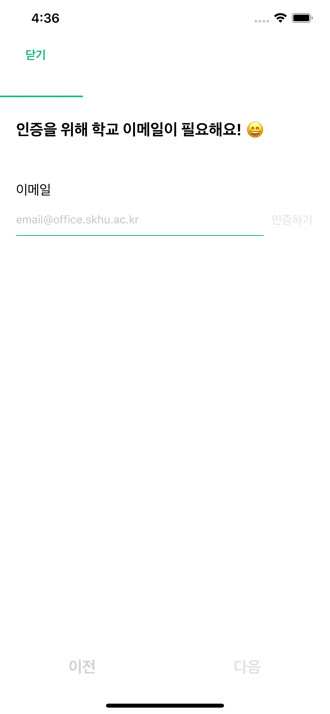

# NUTEE_iOS

## 기능설명

### 	성공회대 구성원들을 위한 커뮤니케이션 어플리케이션 서비스

앱 아이콘
------------

스크린 샷
------------

개발 환경
------------
1. Swift 버전
- 5

2. Xcode 버전
- 11.4.1

3. 사용한 유틸

| 라이브러리           | 사용 이유                          |
| -------------------- | ---------------------------------- |
| Alamofire            | REST API 서버 연동                 |
| Kingfisher           | 이미지 URL 처리                    |
| Snapkit              | 코드로 구현하는 레이아웃           |
| YPImagePicker        | 이미지 다중선택을 위한 ImagePicker |
| Then                 | 코드 단순화를 위해 사용            |
| SwiftKeychainWrapper | 중요 자료 암호화 저장을 위해 사용  |

사용한 Extension
------------

| Extension        | 사용 이유                                |
| ---------------- | ---------------------------------------- |
| Date             | 날짜 처리                                |
| String           | 검색어 encoding to URL / 정규표현식      |
| UIColor          | 각종 공통으로 사용되는 색 지정, hex로 조절                 |
| UIImageView      | Kingfisher로 이미지 처리                 |
| UITabbar         | 탭바 shadow                              |
| UITableView      | 테이블 뷰 emptyView 처리                    |
| UIView           | 레이아웃 처리, 라운딩 처리, 테두리, 모션 |
| CALayer          | shadow, 테두리 처리                      |

사용한 커스텀 클래스
------------

| Extension        | 사용 이유                                |
| ---------------- | ---------------------------------------- |
| NuteeAlert Dialogue / Sheet             | 기본 UIAlertController 디자인을 대체하는 누티 알림 창                                |
| Button           | Resizable, Highlight 기능      |
| MenuBar          | 기존에 라이브러리로 사용한 탭바를 자체 제작한 메뉴바로 대체                 |
| TextView      | 간단한 placeholder 지정 기능                 |
| RefreshControl         | 로딩 인디케이더 크기 지정                              |

팀원 소개
------------

* 김희재 

> 성공회대 소프트웨어공학과 15학번 학생입니다.
>
> NUTEE iOS 파트를 담당하고 있습니다.

* 김은우

> 성공회대 IT융합자율학부 18학번 학생입니다.
>
> NUTEE iOS 파트를 담당하고 있습니다.
